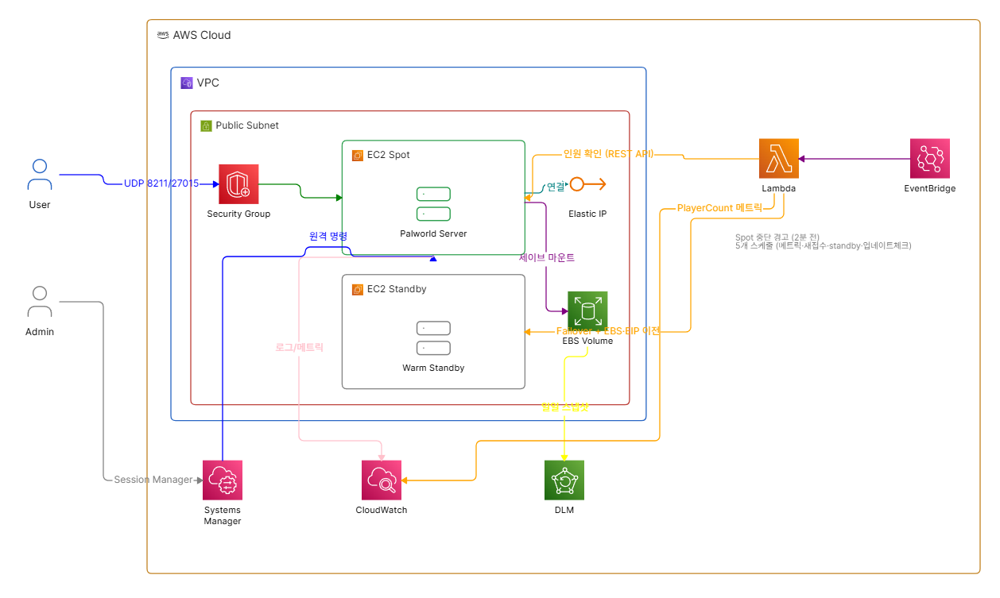

# 아키텍처

친구 3~4명이 상시 접속하는 팰월드(Palworld) 전용 서버를, 스팟 인스턴스로
비용을 절감하면서도 실제 플레이 중 끊김은 최소화하는 것을 목표로 한다.

## 전체 구성



## 1. 컴퓨팅 - 스팟 인스턴스 + persistent/stop

`aws_instance.palworld` (terraform/ec2.tf) 는 `instance_market_options` 로
**persistent 스팟 요청 + interruption_behavior=stop** 을 사용한다.

일반적인 "one-time" 스팟 요청은 중단되면 인스턴스가 **종료(terminate)**되고
끝이지만, persistent + stop 조합은 AWS가 스팟 용량을 회수할 때 인스턴스를
**정지(stop)**시켰다가, 나중에 스팟 용량이 다시 확보되면 **같은 인스턴스를
자동으로 재기동**해준다. 이 동작 하나로 아래 요구사항이 별도 코드 없이
자연스럽게 해결된다.

- "접속자가 0명이면 그냥 종료되게 두고, 나중에 스팟 용량 재확보되면 자동 재기동"
- 정지된 인스턴스는 루트/데이터 EBS 볼륨이 그대로 붙어있고, Elastic IP도
  연결이 풀리지 않으므로 재기동 시 세이브 데이터와 접속 IP가 모두 유지된다.

### 인스턴스 타입 - t3.large가 안 되면 m7i-flex.large

원래는 `t3.large`(2vCPU/8GB)를 기본값으로 잡았는데, AWS 계정이 **Free
Plan**(free-tier eligible 인스턴스 타입만 허용)이면 `RunInstances`가
`InvalidParameterCombination: The specified instance type is not eligible
for Free Tier` 에러로 막힌다. 이 경우 사양이 동일한(2vCPU/8GB) 대안으로
`m7i-flex.large`를 쓰면 된다 - free-tier eligible이고 스팟도 지원한다.

```bash
# 계정에서 실제로 허용되는 free-tier 타입 확인
aws ec2 describe-instance-types --region ap-northeast-2 \
  --filters Name=free-tier-eligible,Values=true \
  --query 'InstanceTypes[*].InstanceType' --output table
```

`m7i-flex`/`c7i-flex` 계열은 T 계열과 달리 **CPU 크레딧 방식이 아니라
항상 일정한 baseline 성능을 보장**하는 타입이라, 오히려 크레딧 고갈로
인한 렉 걱정 자체가 없다. 대신 `CPUCreditBalance` 지표가 존재하지
않으므로, `terraform/cloudwatch.tf` 의 알람은 `instance_type`이 t2/t3/t4g
계열(정규식 `^t[234]g?\.`)일 때만 생성되도록 조건부(`count`)로 처리했다.

## 2. 네트워크 - 보안그룹

`terraform/security_group.tf` 는 인바운드로 아래 두 포트만 허용한다.

| 포트 | 프로토콜 | 용도 |
|---|---|---|
| 8211 | UDP | 팰월드 게임 포트 |
| 27015 | UDP | 쿼리 포트 (서버 상태/핑 조회) |

SSH(22번 포트)는 열지 않는다. 관리 접속은 EC2 인스턴스 역할에 붙인
`AmazonSSMManagedInstanceCore` 정책을 통해 **SSM Session Manager**로 한다
(`terraform output ssm_session_command` 참고). 인바운드 포트를 최소화하면서도
콘솔/CLI로 셸 접속이 가능하다.

## 3. 세이브 데이터 - 별도 EBS 볼륨

`terraform/ebs.tf` 의 `aws_ebs_volume.palworld_data` 는 루트 볼륨과 완전히
분리된 EBS 볼륨이다. 인스턴스가 교체(스팟 → 온디맨드, 또는 그 반대)되어도
이 볼륨만 재부착하면 팰월드 게임 설치본과 세이브가 그대로 유지된다.

- `lifecycle.prevent_destroy = true` 로 실수로 `terraform destroy`를 돌려도
  세이브 볼륨은 남도록 보호했다.
- `scripts/install-palworld.sh` 는 게임 설치 경로 자체(`/mnt/palworld-data/Palworld`)를
  이 볼륨 위에 둔다. 그래서 온디맨드로 대체 기동해도 SteamCMD로 게임을
  다시 받을 필요 없이 바로 이어서 뜬다.
- 볼륨 attach는 인스턴스 자신(초기 스팟 인스턴스는 User Data 스크립트,
  대체 온디맨드 인스턴스는 Lambda)이 수행하며, 두 경로 모두 같은
  `attach-volume` 호출을 하므로 "이미 붙어있음" 에러는 무시하고 넘어가도록
  멱등하게 작성했다.

`prevent_destroy`와 인스턴스 교체 시 재부착은 "인스턴스가 죽어도 볼륨은
살아있다"는 것만 보장하지, 볼륨 자체의 손상/오삭제까지 막아주지는
않는다. 그래서 `terraform/backup.tf` 에 **Data Lifecycle Manager(DLM)**로
매일 새벽(KST 02:00) 자동 스냅샷을 찍고 최근 며칠치(`snapshot_retention_count`
변수, 기본 7개)를 보관하도록 해뒀다. DLM 서비스 자체는 무료고, 스냅샷은
실사용 용량 기준 증분 저장이라(서울 리전 GB당 월 $0.05) 세이브처럼 작은
볼륨은 비용이 크지 않다.

## 4. 스팟 중단 대응 - EventBridge + Lambda

`terraform/eventbridge.tf` 는 계정 전체의 `EC2 Spot Instance Interruption
Warning` 이벤트(중단 2분 전 예고)를 구독해서 `lambda/spot_interruption_handler.py`
를 트리거한다. 인스턴스 ID로 필터링하지 않은 이유는, 대체 기동이 일어날
때마다 인스턴스 ID가 바뀌기 때문이다. 대신 Lambda 내부에서 `Project` 태그로
우리 서버가 맞는지 확인한다.

Lambda의 판단 로직:

1. **접속자 수 확인** - SSM Run Command로 인스턴스 내부에서 팰월드
   REST API(`http://127.0.0.1:8212/v1/api/players`)를 로컬 호출해 접속자
   수를 센다. REST API 응답이 실패하거나 시간 안에 결과를 못 받으면
   **"접속자가 있다"고 안전하게 간주**한다 (불필요한 온디맨드 전환 비용보다
   접속 끊김/세이브 유실이 훨씬 나쁜 결과이기 때문).
2. **0명이면** - 아무것도 하지 않는다. persistent+stop 스팟 요청이 알아서
   인스턴스를 정지시키고, 나중에 자동 재기동한다.
3. **접속자가 있으면** - 다음 순서로 즉시 대체 기동한다.
   1. REST API `/v1/api/announce`로 접속자에게 안내 방송을 보낸다
      ("Server moving to new hardware, reconnect in about 30 seconds") -
      실패해도 페일오버 자체는 막지 않는 fire-and-forget이다.
   2. 기존 스팟 요청을 취소한다 (취소하지 않으면 온디맨드가 뜬 상태에서
      AWS가 나중에 스팟 요청을 다시 채워서 서버가 중복 기동될 수 있다).
   3. **온디맨드 인스턴스**를 확보한다 - 미리 준비해둔 예비(standby)
      인스턴스가 정지 상태로 있으면 그걸 시작해서 재활용하고(빠름),
      없으면 처음부터 새로 띄운다(느림). 자세한 내용은 아래 "예비
      인스턴스" 섹션 참고.
   4. 세이브 데이터 EBS 볼륨을 기존 인스턴스에서 분리해 새 인스턴스에 붙인다.
   5. 예비 인스턴스를 재활용한 경우, 이 시점에 볼륨 마운트 + systemd
      서비스 등록/기동을 수행한다 (예비 인스턴스는 패키지/SteamCMD만
      미리 준비돼 있고 아직 실제 게임을 서비스하고 있지 않으므로).
   6. Elastic IP를 새 인스턴스로 재연결한다 - 친구들은 같은 IP로 재접속만
      하면 된다.
   7. 기존 스팟 인스턴스를 명시적으로 종료한다.

### 예비(warm standby) 인스턴스로 전환 시간 단축

처음부터 온디맨드 인스턴스를 새로 띄우면 패키지 설치 + SteamCMD 재검증
때문에 실제로 플레이 가능해지기까지 30~90초 정도 더 걸린다. 이걸
줄이려고 `task=ensure_standby` 스케줄(기본 15분 간격,
`standby_check_interval_minutes` 변수)이 항상 예비 인스턴스 하나를
준비된 상태로 유지한다.

- 예비 인스턴스가 없으면 `scripts/warm-standby.sh` (세이브 볼륨을 건드리지
  않고 패키지 설치 + SteamCMD 부트스트랩만 하는 경량 스크립트)로 새로 띄운다.
- 준비가 끝나면(`/tmp/standby-ready` 마커 파일 확인) 정지시켜서 컴퓨트
  비용 없이 대기시킨다 (루트 볼륨 스토리지 비용만 미미하게 발생).
- 스팟 중단으로 온디맨드가 필요해지면, 이 정지된 예비 인스턴스를 그냥
  "시작"만 시키고 `Role` 태그를 `standby` -> `server`로 바꿔서 재활용한다.
  패키지/SteamCMD가 이미 준비돼 있으니 볼륨 마운트 + systemd 서비스
  등록/기동만 하면 되고, 이게 훨씬 빠르다.
- 예비 인스턴스를 한 번 소모하면 다음 `ensure_standby` 주기에 새 예비
  인스턴스가 자동으로 다시 준비된다.

`_find_running_instance()`(스팟 복귀 체크, 지표 기록에서 쓰는 "지금 서비스
중인 인스턴스 찾기" 함수)는 `Role=server` 태그로 실제 서버만 골라내고
예비 인스턴스는 제외한다. 그래서 초기 Terraform 인스턴스와 Lambda가
새로 띄우는 인스턴스 모두 `Role=server` 태그를 붙인다.

### 온디맨드 -> 스팟 자동 복귀

`terraform/eventbridge.tf` 의 `aws_cloudwatch_event_rule.spot_reclaim_schedule` 이
기본 30분(`spot_reclaim_check_interval_minutes` 변수)마다 같은 Lambda를
Scheduled Event로 깨운다. Lambda는 이벤트의 `detail-type` 으로 두 트리거를
구분해서 처리한다 (`handler` 함수 참고).

이 스케줄 체크는:

1. `Project` 태그가 붙은 실행 중 인스턴스를 찾는다.
2. 이미 스팟이면(`InstanceLifecycle == "spot"`) 아무것도 안 하고 끝낸다.
3. 온디맨드로 떠있다면 - 즉 과거에 중단 예고 때 대체 기동이 있었다는 뜻 -
   접속자 수를 확인한다.
4. **접속자가 있으면** 아무것도 하지 않고 다음 주기를 기다린다 (플레이
   중인 세션을 스팟 전환 때문에 끊고 싶지 않으므로).
5. **접속자가 없으면** 새 스팟 인스턴스(persistent+stop) 기동을 시도한다.
   스팟 용량이 아직 없어서 `RunInstances`가 실패하면(`ClientError`) 그냥
   로그만 남기고 다음 주기에 다시 시도한다. 성공하면 세이브 볼륨과
   Elastic IP를 새 스팟 인스턴스로 옮기고 온디맨드 인스턴스를 종료한다.

즉, 스팟↔온디맨드 전환은 양방향 모두 "접속자가 없을 때만 건드린다"는
같은 원칙으로 동작한다. 스팟 중단 예고 시점에 접속자가 있으면 온디맨드로,
그 뒤 접속자가 빠지면 다시 스팟으로 - 자연스럽게 왔다갔다 하되, 항상
안전한 타이밍에만 전환이 일어난다.

### 한계 / 운영 노트

- **2분이라는 시간 제약**: 스팟 중단 예고는 AWS 사양상 항상 2분 전에
  온다. Lambda가 접속자 확인 + 온디맨드 기동 + 볼륨/EIP 이전을 그 안에
  끝내야 하므로 다소 빠듯하다 (`variables.tf`의 `lambda_timeout` 기본값
  110초). 네트워크/AWS API 지연이 겹치면 짧은 접속 끊김이 발생할 수 있다.
  (온디맨드->스팟 방향은 예고 시간에 쫓기지 않으므로 이 제약이 없다.)
- **Terraform state 드리프트**: Lambda가 인스턴스를 대체 기동하면
  `aws_instance.palworld`, `aws_eip_association.palworld`,
  `aws_cloudwatch_metric_alarm.cpu_credit_balance` 는 Terraform state 상으로는
  여전히 "이전 인스턴스"를 가리키게 된다. Lambda가 실제 인프라는 정상적으로
  옮겨주지만, `terraform plan`을 돌리면 죽은 인스턴스에 대한 diff가 보일 수
  있다 - 실사용에는 지장 없지만, Terraform으로 다시 관리하고 싶다면
  `terraform apply -replace="aws_instance.palworld"` 로 재조정하면 된다.
- **CPUCreditBalance 알람**도 위와 같은 이유로 초기 인스턴스 ID를
  대상으로 생성된다. 대체 기동이 여러 번 반복되면 알람이 이미 없어진
  인스턴스를 가리키게 될 수 있어, 필요하면 다시 만들어줘야 한다.
- **주기 체크 비용/지연**: 기본 30분 간격이라, 스팟 용량이 재확보돼도
  최대 30분은 온디맨드 요금이 더 나갈 수 있다. 간격을 줄이면 복귀는
  빨라지지만 SSM Run Command 호출이 늘어난다 (비용은 미미한 수준).
- **user_data와 실행 중인 인스턴스**: `aws_instance.palworld`에
  `lifecycle.ignore_changes = [user_data]` 를 걸어뒀다. `scripts/install-palworld.sh`
  를 고치면 렌더링된 `local.user_data`가 바뀌는데, 이걸 이미 떠있는
  인스턴스에 반영하려면 AWS가 정지->수정->재시작을 거쳐야 한다. 그런데
  persistent 스팟 인스턴스를 이렇게 수동으로 정지시키면 spot request가
  `disabled` 상태로 빠지고, 바로 이어지는 재시작 시도가
  `IncorrectSpotRequestState` 에러로 실패할 수 있다(실제로 이 문제로
  서버가 잠깐 다운된 적 있음 - 몇 초~몇십 초 뒤 상태가 정리되면 수동으로
  `start-instances`는 가능했다). 그래서 이미 떠있는 인스턴스는 그대로
  두고, 스크립트 변경사항은 `aws_ssm_parameter.user_data`를 통해 앞으로
  Lambda가 새로 띄우는 인스턴스에만 반영되게 했다.
- **예비 인스턴스는 스팟->온디맨드 방향에만 쓰인다**: 온디맨드->스팟
  복귀는 시간 제약이 없어서 그냥 새로 스팟 요청을 넣으면 되고, "정지된
  스팟 인스턴스를 미리 준비"하는 개념 자체가 성립하지 않는다(스팟은
  그 순간의 용량 요청이라서).
- **예비 인스턴스를 소모한 직후**: 다음 `ensure_standby` 주기(기본 15분)
  전까지는 예비 인스턴스가 없는 상태다. 그 사이에 또 스팟 중단이 발생하면
  처음부터 새로 띄우는 느린 경로로 자동 대체된다 (안전하게 동작은 하되
  이번엔 시간 단축 효과가 없다).
- **RCON 대신 REST API**: 안내 방송은 원래 RCON의 `Broadcast` 명령으로도
  가능하지만, Pocketpair가 RCON 자체를 deprecated 처리한다고 공지해서
  대신 REST API `/v1/api/announce`를 쓴다.
- **destroy 시 Terraform이 추적하지 못하는 리소스**: Lambda가 boto3로 직접
  띄운 예비 인스턴스나 페일오버로 대체 기동된 인스턴스는 애초에 Terraform
  state에 없다. 그래서 `terraform destroy`로 정리해도 이 인스턴스들이
  붙잡고 있는 보안그룹 등은 삭제가 막힐 수 있다(실제로 겪음 -
  보안그룹이 "Still destroying..."에서 몇 분간 안 넘어감). 이런 경우
  `aws ec2 describe-instances`로 남은 인스턴스를 직접 찾아
  `terminate-instances`로 정리한 뒤 다시 destroy하면 된다.

## 5. 모니터링 - CPUCreditBalance 알람

`terraform/cloudwatch.tf`. t3 계열은 버스터블(CPU 크레딧 기반) 인스턴스라
팰월드처럼 CPU를 지속적으로 쓰는 게임 서버는 크레딧이 바닥나면
스로틀링되어 렉의 원인이 된다. `CPUCreditBalance` 지표가 임계값
(기본 50, `cpu_credit_balance_alarm_threshold` 변수) 아래로 5분 x 2회
연속 떨어지면 알람이 울리고, `alarm_notification_email` 변수를 채우면
이메일(SNS)로 알림을 받는다.

## 6. 모니터링 - CloudWatch 대시보드 & 접속자 수 지표

`terraform/dashboard.tf` 는 CPU 사용률, 네트워크 In/Out(둘 다 EC2 기본
제공 지표), 접속자 수(커스텀 지표)를 한 화면에서 보는 대시보드다
(`palworld-server`라는 이름으로 CloudWatch 콘솔에 생성됨).

접속자 수는 AWS가 원래 알 수 있는 정보가 아니라 팰월드 REST API에서만
나오는 값이라, `lambda/spot_interruption_handler.py`에 세 번째 스케줄
작업(`task=record_metrics`, 기본 5분 간격, `metrics_check_interval_minutes`
변수)을 추가해서 SSM으로 접속자 수를 확인하고 `<project>/GameServer`
네임스페이스의 `PlayerCount` 커스텀 지표로 남긴다. 스팟 중단 대응/스팟
복귀 체크와 같은 Lambda를 재사용하되, EventBridge 타겟의 `input`으로
`{"task": "..."}` 를 넘겨서 세 가지 트리거(중단 예고/복귀 체크/지표 기록)를
구분한다.

CPU/네트워크 위젯은 특정 인스턴스 ID를 지정하는 대신 `SEARCH('{AWS/EC2,
InstanceId} MetricName="..."', ...)` 표현식을 써서, 인스턴스가
스팟↔온디맨드로 바뀌어도 대시보드를 수동으로 고칠 필요가 없게 했다
(계정에 팰월드 인스턴스 하나만 있다는 전제 - 개인 프로젝트 규모에서는
문제 없음).

## 7. 설치 자동화 - User Data

`scripts/install-palworld.sh` 가 EC2 User Data로 실행되며 다음을 한다.

1. SteamCMD 실행에 필요한 32bit 멀티립 패키지 설치 (Ubuntu 22.04 기준)
2. 세이브 데이터 EBS 볼륨 attach + mount (NVMe 디바이스 매핑 처리 포함)
3. SteamCMD로 팰월드 전용 서버(App ID `2394010`) 설치
4. `PalWorldSettings.ini` 최초 1회 생성 (서버 이름/설명/비밀번호/최대 인원 등)
5. `systemd` 서비스(`palworld.service`) 등록 및 기동 - 크래시 시 자동 재시작

## 8. 팰월드 자동 업데이트 - task=check_game_update

팰월드 클라이언트는 Steam을 통해 자동 업데이트되지만, 서버 쪽 SteamCMD
설치본은 사람이 직접 업데이트해주기 전까지 그대로 멈춰있다. 그냥 두면
클라이언트/서버 버전이 어긋나서 접속 자체가 안 되는 상황이 생긴다
(실제로 겪었다).

`task=check_game_update` 스케줄(기본 6시간 간격,
`game_update_check_interval_hours` 변수)이 이걸 자동으로 해결한다:

1. 접속자 수를 확인한다.
2. **접속자가 있으면** 아무것도 안 하고 다음 주기를 기다린다 (플레이 중에
   서버를 내리고 싶지 않으므로).
3. **접속자가 없으면** 서버를 정지 → `steamcmd +app_update 2394010
   validate` 실행 → 서버 재시작.
4. SteamCMD는 업데이트 실패 상태(`StateFlags=6`)를 매니페스트 파일에
   남겨두고, 재시도할 때마다 다운로드도 안 해보고 같은 에러를 반복하는
   오래된 버그가 있다(실제로 겪었음). 그래서 업데이트 후 설치된
   `buildid`가 `TargetBuildID`와 다르면 매니페스트 파일(`appmanifest_
   2394010.acf`)을 지우고 한 번 더 시도한다.
5. 버전이 실제로 바뀌었으면(`buildid`가 달라지면) SNS로 알림을 보낸다
   (`alarm_notification_email` 변수가 설정된 경우).

접속자 수 확인은 스팟 중단 대응과 같은 로직(`_get_player_count`)을
재사용한다. 팰월드 REST API가 가끔(아마 SteamCMD 검증처럼 CPU를 많이
쓰는 직후) 빈 응답을 주는 걸 실제로 관찰해서, curl을 최대 3번까지
짧게 재시도하도록 만들었다. 그래도 확인이 안 되면 다른 스케줄들과
동일하게 "접속자가 있다"고 안전하게 간주하고 건너뛴다.

## 왜 Amazon Linux가 아니라 Ubuntu인가

SteamCMD는 32bit 바이너리를 필요로 하는데, Amazon Linux 2023은 32bit
멀티립 저장소를 제공하지 않는다. Ubuntu 22.04는 `dpkg --add-architecture
i386` 로 공식 지원하므로 팰월드/SteamCMD 계열 서버 배포에는 Ubuntu가
사실상 표준이다. AMI는 Canonical이 공식 관리하는 SSM 파라미터
(`/aws/service/canonical/ubuntu/server/22.04/stable/current/amd64/hvm/ebs-gp2/ami-id`)
로 항상 최신 버전을 가져온다.
